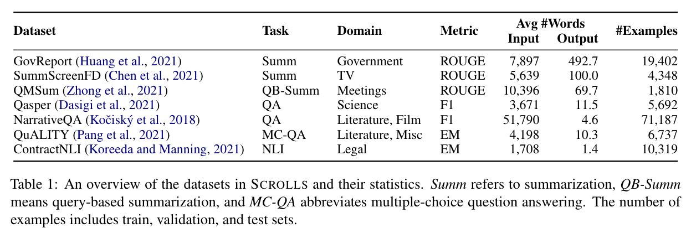

# SCROLLS benchmark

> SCROLLS is a suite of datasets that require synthesizing information over long texts. The benchmark includes seven natural language tasks across multiple domains, including summarization, question answering, and natural language inference.

data: https://huggingface.co/datasets/tau/scrolls, https://www.scrolls-benchmark.com/tasks

paper: https://arxiv.org/abs/2201.03533

repository: https://github.com/tau-nlp/scrolls

leaderboard: https://www.scrolls-benchmark.com/leaderboard

[SLED paper](https://arxiv.org/abs/2208.00748) has additionally used SQuAD and HotPotQA (with two gold paragraphs): https://huggingface.co/datasets/tau/sled to benchmark long-text models.



This dataset is formatted in text-to-text format and is well suited for encoder-decoder and decoder-only models. Encoder-only models could be benchmarked on ContractNLI text classification task and multiple-choice QA on QuALITY.

## Fine-tuning
### ContractNLI
example scripts with grid search: `finetune_contract_nli_encoder.sh` & `finetune_contract_nli.sh`:
```bash
CUDA_VISIBLE_DEVICES=0,1 NP=2 ./finetune_contract_nli.sh
```

### QuALITY
script: `finetune_quality.sh`

### Qasper
script: `finetune_qasper.sh`


> TODO: report the best set of params and scores

> TODO: add qmsum, narrative_qa, summ_screen_fd, gov_report

## How to generate test set predictions
TBD
